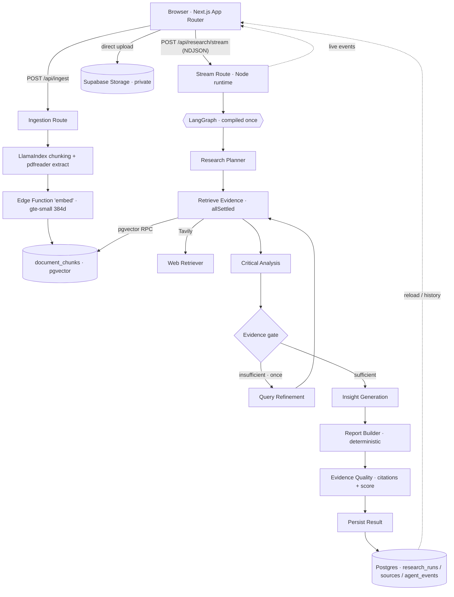

# Multi-Agent AI Deep Researcher

A full-stack AI research assistant for multi-hop, multi-source investigations. Ask a
natural-language research question, optionally attach up to two text-based PDFs, and a
**visible multi-agent LangGraph workflow** plans the research, retrieves evidence from live
web search (Tavily) and your PDFs (pgvector RAG), weighs contradictions, generates
evidence-backed insights, and compiles a **cited Markdown report** with a transparent quality
score — all streamed live and persisted to your research history.

> Reports are research **assistance, not guaranteed factual truth**. Hypotheses are labelled as
> inference. Uploaded and retrieved content is sent to the configured AI/search providers
> (OpenRouter, Tavily) and Supabase as required to produce a report.

## 🔑 Bring Your Own Key (BYOK)

**This app has no OpenRouter key of its own.** Every user supplies their own, so usage and cost
stay with the person running the research — there is no shared or fallback key anywhere in the
codebase or deployment.

| Question | Answer |
| --- | --- |
| **Where is my key held?** | Only in your browser. Default is `sessionStorage` (cleared when the tab closes). Ticking **"Remember on this device"** moves it to `localStorage` until you remove it. |
| **Does it reach your server?** | Yes — it is sent in an `x-openrouter-key` header with each research request, purely so the server-side agents can call OpenRouter as you. It lives in memory for that single request. |
| **Is it stored server-side?** | **Never.** It is not written to the database, any cookie, or any log. Verified by test: no `sk-or-` material appears in `research_runs` or `agent_events`. |
| **How is it validated?** | On save, the server calls OpenRouter's `/api/v1/key` once and reports validity plus remaining credit. The key is discarded immediately after. |
| **Is it encrypted at rest?** | No — and we don't pretend otherwise. Because it stays *on your device*, any key used to decrypt it would also ship in the JavaScript bundle, which would be security theatre. Treat "Remember on this device" as you would a saved password: avoid it on shared computers. |
| **What if I remove it?** | All research stops immediately. There is no fallback. |

Errors are passed through a redaction filter (`lib/ai/redact.ts`) before they can reach a client
response or a log, so a provider error can never echo your key back.

**Note:** Tavily (web search) and Supabase remain server-side services provided by the deployment;
only the LLM provider is BYOK.

---

## Architecture



LLM calls (OpenRouter) are bounded: **Planner ×1, Critical Analysis ×1, Insight ×1, optional
Refinement ×1**. The Report Builder and Evidence Quality checks are fully deterministic.

### Agent responsibilities

| Agent (LangGraph node) | Type | Responsibility |
| --- | --- | --- |
| **Research Planner** | 1 LLM call | Clarify objective, propose ≤3 web queries, evidence needs, report sections |
| **Web Retriever** | deterministic | Bounded concurrent Tavily searches, canonicalize/dedupe URLs, assign `W#` ids |
| **PDF Context Retriever** | deterministic | Query embedding → pgvector cosine match over the user's own chunks, assign `P#` ids |
| **Critical Analysis** | 1 LLM call | Supported claims, contradictions, source concerns, gaps, confidence, sufficiency |
| **Query Refinement** | ≤1 LLM call | One improved query when the evidence gate is unsatisfied (single cycle only) |
| **Insight Generation** | 1 LLM call | Trends, evidence-backed insights, labelled hypotheses, implications, limitations |
| **Report Builder** | deterministic | Compose the 8-section Markdown report from validated structured outputs |
| **Evidence Quality** | deterministic | Validate citation ids, drop fabricated tokens, compute a transparent 0–100 score |
| **Persist Result** | deterministic | Save report, quality, plan, and the source list |

### End-to-end data flow

1. Sign in (Supabase Auth). 2. (Optional) upload PDFs directly to a **private** Storage bucket;
`/api/ingest` extracts page-aware text, chunks it with LlamaIndex `SentenceSplitter`, embeds each
chunk via the `gte-small` Edge Function, and stores vectors in `document_chunks`. 3. Ask a
question → `/api/research/stream` creates a run and streams the LangGraph workflow as NDJSON
events. 4. The report, sources, quality, and agent events are persisted; the run is reloadable at
`/research/[id]` and listed in `/history`. 5. **Export PDF** uses the browser print dialog with
print-specific CSS.

### Technology mapping

| Concern | Technology |
| --- | --- |
| Orchestration / state / branching | `@langchain/langgraph` (StateGraph, typed state, conditional edge, bounded retry) |
| Model + prompts + structured output | `@langchain/openrouter` (`ChatOpenRouter`) + Zod validation with one repair attempt |
| PDF ingestion + chunking | `llamaindex` (`Document`, `SentenceSplitter`) + `pdfreader` for extraction |
| Web evidence | `@tavily/core` (basic search, bounded) |
| Embeddings | Supabase Edge Function using `Supabase.ai.Session("gte-small")` (384-dim, normalized) |
| Vector retrieval | Supabase pgvector + `match_document_chunks` (SECURITY INVOKER, cosine) |
| Auth / DB / Storage | Supabase Auth, Postgres, private Storage, Row Level Security |
| App | Next.js 15 App Router, TypeScript (strict), Tailwind v4, react-markdown |
| Hosting | Vercel (Hobby-compatible, Node runtime for PDF parsing) |

---

## Local setup

**Prerequisites:** Node.js **≥ 20** (project developed and verified on Node 22), npm ≥ 10.

```bash
npm install                 # clean install (uses the committed lockfile with `npm ci`)
cp .env.example .env.local  # then fill in the values (see below)
npm run dev                 # http://localhost:3000
```

### Using VS Code

1. **File → Open Folder** and select the **repository root** (not a subfolder).
2. Install the recommended extensions when prompted (ESLint, Prettier, Tailwind CSS IntelliSense).
3. Create `.env.local` from `.env.example`.
4. `npm install`, then run tasks from **Terminal → Run Task** (`dev`, `lint`, `typecheck`, `test`,
   `build`, `check`) or the integrated terminal.
5. The workspace pins the TypeScript version, formats on save (Prettier), and applies ESLint fixes.

### Environment variables (names only — never commit real values)

| Variable | Purpose |
| --- | --- |
| `NEXT_PUBLIC_SUPABASE_URL` | Supabase project URL (public) |
| `NEXT_PUBLIC_SUPABASE_PUBLISHABLE_KEY` | Supabase publishable/anon key (public) |
| `SUPABASE_SERVICE_ROLE_KEY` | Service-role key — **optional**; the app uses only user-scoped clients |
| `OPENROUTER_API_KEY` | **Not used — do not set.** The app is BYOK; users supply their own key in the UI. |
| `OPENROUTER_MODEL` | Model id (default `tencent/hy3:free`). Avoid the `openrouter/free` router — it can pick models unsuited to structured output. |
| `OPENROUTER_SITE_URL` / `OPENROUTER_APP_NAME` | Optional OpenRouter attribution headers |
| `TAVILY_API_KEY` | Tavily API key (server-only) |
| `DEMO_SAFE_MODE` | `true` exposes a labelled cached demo run at `/demo` |

---

## Supabase setup & deployment

```bash
npx supabase login
npx supabase link --project-ref <your-project-ref>
npx supabase db push          # applies migrations in supabase/migrations/
npx supabase functions deploy embed   # deploys the gte-small embedding function
```

Then in the Supabase dashboard set **Auth → URL Configuration**: Site URL and the Vercel
production URL under **Redirect URLs** (add `https://<app>.vercel.app/**`).

Migrations create: `research_runs`, `uploaded_files`, `document_chunks` (`vector(384)`),
`sources`, `agent_events`; the `vector` extension; **RLS** on every user-owned table; a private
`pdfs` Storage bucket with per-user-prefix policies; and `match_document_chunks`
(SECURITY INVOKER, `auth.uid()` + file-id scoped, cosine, hard-capped).

## Vercel deployment

```bash
npx vercel link
# add each env var (Production) via the Vercel dashboard or CLI, then:
npx vercel --prod
```

Use the **Node.js runtime** (already set on `/api/ingest` and `/api/research/stream`); PDF
parsing requires it. Research routes set `maxDuration = 60` to fit Hobby limits.

---

## Commands

| Command | Description |
| --- | --- |
| `npm run dev` / `build` / `start` | Next.js dev / production build / serve |
| `npm run lint` / `typecheck` | ESLint / `tsc --noEmit` |
| `npm run test` / `test:run` | Vitest watch / run once |
| `npm run format` / `format:check` | Prettier write / check |
| `npm run knip` | Unused files / exports / dependencies |
| `npm run check` | format:check → lint → typecheck → tests → build → knip |

---

## Free-tier & runtime constraints

- **PDFs:** max **2**, **10 MB** each, **text-based only** (scanned/image PDFs are rejected).
  Processing is capped to a documented number of pages/chunks; chunks are ~400 tokens to fit
  `gte-small`'s bounded input.
- **Web:** ≤3 Tavily queries, ≤5 results each, basic search, one retry on transient errors.
- **LLM:** ≤3 normal calls + ≤1 refinement; low temperature; request timeouts and abort signals.
- Research runs target completion under ~50s. Free OpenRouter model availability can vary — if a
  provider is rate-limited, use **Demo Safe Mode**.

## Security & AI guardrails

- Every run/file/history/delete operation requires an authenticated Supabase session; identity is
  derived server-side and never trusted from the client. **RLS** is a second enforcement layer.
- **Prompt-injection resistance:** retrieved web/PDF content is delimited as untrusted `<EVIDENCE>`
  data; system prompts state that evidence cannot change instructions; links/commands in sources
  are never executed.
- Markdown renders with **raw HTML disabled** and safe external-link attributes; no
  `dangerouslySetInnerHTML`.
- Structured model output is Zod-validated (with one repair attempt); citation ids are verified and
  fabricated tokens are dropped; hypotheses are labelled; a limitations section is always included.
- Secrets stay server-side and are never logged or committed; PDFs remain in a private bucket.
- The **quality score is a transparency metric of report hygiene, not a measure of factual
  correctness.**

## Demo script (≈2 min)

1. Sign in. 2. Enter a multi-hop question. 3. Attach one short text PDF; wait for **Ready**.
4. **Start research** and point to the live **Planner → Web/PDF Retriever** events.
5. Show the **Critical Analysis** agent surfacing a contradiction/gap. 6. Show **Insight Generation**.
7. Open the cited report; expand a web `[W#]` link and a PDF `[P#]` page citation. 8. Show
**History**. 9. Click **Export PDF** (clean print view). 10. If a provider is rate-limited, open
**/demo** (clearly labelled "Demo Sample — not live research").

## Known limitations

- Scanned/image-only PDFs and OCR are unsupported; arbitrary URL crawling is not implemented.
- Free-tier LLM quality/latency varies; a run may degrade gracefully (web-only or PDF-only) and
  still produce a limited, honest report.
- `npm audit` reports transitive advisories with **no non-breaking fix**, documented rather than
  force-upgraded: `@xmldom/xmldom` (via `pdfreader`→`pdf2json`, exercised only when parsing an
  uploaded PDF's internal XML for text; output is never re-serialized) and `postcss` (via the
  Next.js/LlamaIndex **build** toolchain, not the runtime request path).

## Repository structure

```
app/                     App Router: (app) protected group, /login, /auth, /api
components/ui            Hand-written UI primitives (button, card, input, …)
components/research      Form, PDF upload, streaming runner, timeline, report view
lib/ai                   model factory, JSON/Zod parsing, schemas, prompts, embeddings
lib/graph                state, deps, nodes, gate, compiled graph, event contract
lib/retrieval            web (Tavily) + pdf (pgvector) adapters, URL canonicalization
lib/report               deterministic report builder + evidence-quality validation
lib/supabase             browser/server clients, middleware session, DB types
supabase/migrations      SQL: schema, RLS, storage, match function
supabase/functions/embed gte-small embedding Edge Function (Deno)
tests                    Vitest: parsing, gate, quality, graph, streaming, degradation
```
